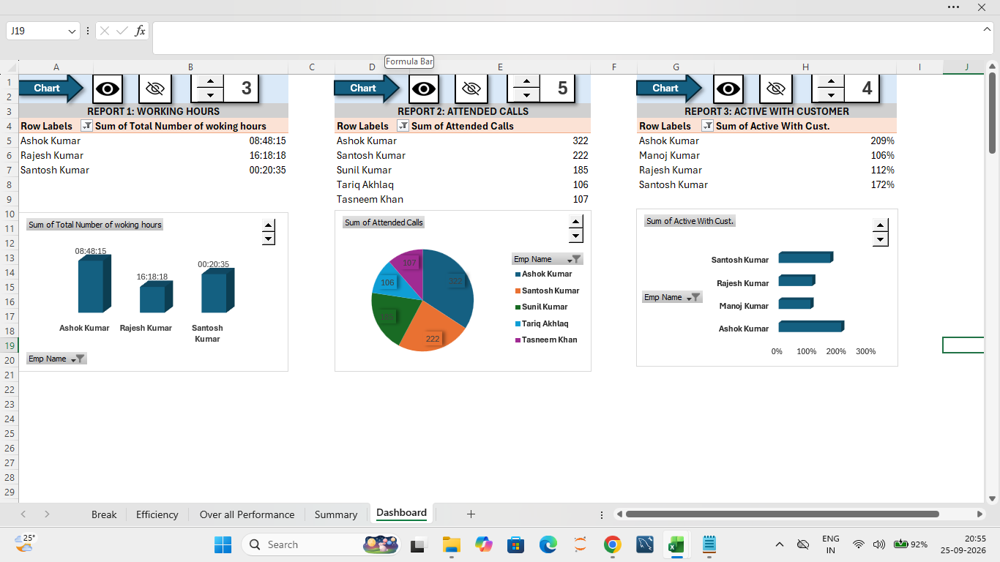

# Employee Performance Analytics Dashboard

An interactive Employee Performance Analytics Dashboard developed using Microsoft Excel and VBA.

## Project Overview

This project analyzes employee performance data collected from multiple Excel sheets. The data was consolidated into a Summary Sheet and then analyzed using PivotTables and PivotCharts.

## Key Features

- Consolidated employee data from multiple sheets
- Used VLOOKUP, MID, FIND and TIMEVALUE for data preparation
- Created PivotTables for performance analysis
- Created PivotCharts for visualization
- Added Spin Buttons for dynamic Top-N filtering
- Used VBA Macros to automate PivotTable filtering
- Added Hide/Show controls for dashboard sections
- Built an interactive Excel dashboard

## Key Metrics

- Total Working Hours
- Work Efficiency
- Total Break Taken
- Attended Calls
- Active With Customer

## Tools & Technologies

- Microsoft Excel
- Advanced Excel
- PivotTables
- PivotCharts
- VBA
- Macros
- Form Controls
- Data Analysis

## Project Workflow

Raw Data
↓
Summary Sheet
↓
Data Consolidation
↓
PivotTables
↓
PivotCharts
↓
VBA Automation
↓
Interactive Dashboard

## Project Demo

The dashboard includes interactive Spin Buttons and VBA-based Hide/Show controls for dynamic analysis.

## Project Screenshot

